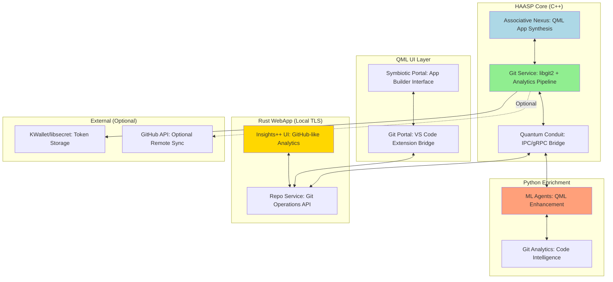

# HAASP + Git Integration: Production Plan

## Spec Provenance
- **Base System**: HAASP (Hyper-Advanced Associative Application Synthesis Platform) - QML/C++/Python hybrid app builder
- **Git Module**: TO-SAP-001R3 Git Integration & "Insights++" UX v1.2.0 by Saphyre Solutions LLC
- **Target Platform**: Arch Linux + Zen kernel + KDE Plasma 6 + Wayland + NVIDIA RTX 3050 Ti + nvidia-open-dkms

## Spec Header
**Name**: HAASP with Git-Native Development Platform  
**Smallest Scope**: QML app builder with integrated Git analytics, local-first development workflow, and GitHub-like insights UI  
**Non-Goals**: 
- Cloud-dependent features (remain local-first)
- X11 compatibility (Wayland-only)
- Proxy/MCP layers (direct API only)
- Token storage on disk (KWallet/libsecret only)

## Paths to Supplementary Guidelines
- Design: https://raw.githubusercontent.com/memextech/templates/refs/heads/main/design/dark-modern-professional.md (for Insights++ UI)
- Tech Stack: Custom hybrid C++/QML/Python + Rust WebApp (local TLS server)

## Decision Snapshot

### Architecture Fusion
HAASP's existing C++ nucleus now includes **Git Service** alongside the Associative Nexus:



### Key Integration Points

1. **VS Code Extension** bridges QML app building with Git workflows
2. **Git Service** (libgit2) provides repository management, analytics, and risk assessment
3. **Insights++ WebApp** delivers GitHub-like UI with advanced code intelligence
4. **Python agents** enrich both QML generation and Git analytics
5. **Hybrid persistence** stores both app artifacts and Git metrics in HAN (Hybrid Archival Nexus)

## Architecture at a Glance

### Component Integration Matrix

| HAASP Component | Git Integration | Shared Resources |
|-----------------|-----------------|------------------|
| **Associative Nexus** | Links QML artifacts to Git commits | SQLite tables, commit SHAs |
| **Symbiotic Portal** | Adds Git status to QML editor | File change detection |
| **Python Agents** | Code quality analysis on Git diffs | ML models, risk scoring |
| **HAN Storage** | Git analytics time-series | RocksDB, SQLite federation |

### New Data Flows

1. **QML Edit → Git Hook**: Auto-commit generated QML with metadata
2. **Git Analytics → QML Insights**: Surface code quality in app builder UI
3. **Commit Risk → Build Gate**: Block dangerous changes pre-push
4. **Ownership Analysis → Team Insights**: Show QML expertise distribution

## Implementation Plan

### Phase 1: Foundation Integration (Weeks 1-4)
**Focus**: Merge Git Service into HAASP C++ core

**Tasks**:
- Vendor libgit2 (pinned commit) into HAASP build system
- Implement GitRepo wrapper class in `src/nucleus/git_repo.cpp`
- Add Git service to Quantum Conduit message routing
- Create unified CMake build for C++ nucleus + Git dependencies

**Git-Specific Features**:
- Repository detection and initialization
- Commit DAG traversal with semantic diff analysis
- Hook installation for HAASP-generated QML files
- Integration with existing HAN storage for Git metadata

**Testing Strategy**:
- Import Qt source repo (large scale test)
- Performance benchmark: 100k commits in <6 minutes
- Deterministic analytics across multiple runs

### Phase 2: VS Code Extension Bridge (Weeks 5-8)
**Focus**: Extend HAASP VS Code extension with Git commands

**Tasks**:
- Add N-API bridge for Git Service calls
- Implement Git command palette integration
- Create QML file tracking with Git status indicators
- Build local PR-like workflow for QML iterations

**QML-Git Integration**:
- Auto-stage generated QML with semantic commit messages
- Git blame integration in QML property inspector
- Version control for QML component libraries
- Diff visualization for QML property changes

### Phase 3: Analytics & Insights++ (Weeks 9-12)
**Focus**: Build Rust WebApp with GitHub-like analytics

**Technologies**:
- **Backend**: Rust + Leptos (SSR)
- **Frontend**: Primer-style CSS (vendored, MIT licensed)
- **Transport**: TLS-only local server (127.0.0.1:7420)
- **Data**: SQLite time-series + RocksDB cache

**Advanced Analytics Beyond GitHub**:
- **QML-Specific Metrics**: Component complexity, binding performance, property churn
- **Risk Assessment**: SZZ algorithm for bug-introducing QML changes
- **Ownership Maps**: Bus factor analysis for QML component libraries
- **Temporal Coupling**: Files that change together in QML development
- **Performance Correlation**: Git changes vs QML render performance

**UI Components**:
```
Insights++ Pages:
├── Overview: Repository health + QML project stats
├── Commits: Risk-scored timeline with QML semantic diffs  
├── Graphs: Dependency coupling + ownership sunbursts
├── Insights++: HAASP-specific metrics (QML quality, component reuse)
├── PRs: Local PR-like workflow for QML iterations
└── Security: Secret scanning + QML security patterns
```

### Phase 4: Python ML Enhancement (Weeks 13-16)
**Focus**: Enhance Python agents with Git-aware intelligence

**ML Capabilities**:
- **Code Quality Prediction**: Train models on Git history to predict QML issues
- **Change Impact Analysis**: ML-powered blast radius estimation
- **Automated Code Review**: Git diff analysis with QML best practices
- **Performance Regression Detection**: Correlate Git changes with QML render metrics

**Self-Improving Loop**:
- Collect Git + QML quality metrics continuously
- Retrain models on local development patterns
- Improve QML generation based on Git success patterns
- Organism-like agents replicate successful patterns

### Phase 5: Production Hardening (Weeks 17-20)
**Focus**: Security, performance, and deployment readiness

**Security Hardening**:
- AppArmor profile for Git Service process isolation
- KWallet/libsecret integration for GitHub tokens (never disk storage)
- Commit signing enforcement (GPG/SSH)
- Pre-push gates for secret detection + policy compliance

**Performance Optimization**:
- Git operations profiling and caching strategies
- Insights++ WebApp optimization (<300ms render from cache)
- Real-time analytics streaming via Server-Sent Events
- Memory-efficient Git object storage

**Deployment Features**:
- Arch Linux PKGBUILD with all dependencies
- Systemd services for background Git analytics
- Docker compose for optional containerized deployment
- CI/CD pipeline with SBOM generation and signing

## Verification & Demo Script

### End-to-End Demo Flow
```bash
# 1. Initialize HAASP project with Git integration
mkdir demo-qml-app && cd demo-qml-app
sapctl init --template qml-kirigami --git
code .  # Opens VS Code with HAASP extension

# 2. Create QML component with Git tracking
# In VS Code: Ctrl+Shift+P → "HAASP: Create Component"
# Creates Button.qml + auto-commits with semantic message

# 3. View Git analytics in Insights++
# Extension automatically opens http://127.0.0.1:7420/repo/insights

# 4. Make QML changes and observe risk scoring
# Edit Button.qml properties → Git hook calculates risk
# High-risk changes trigger pre-push gate

# 5. Create local PR for QML iteration
sapctl git pr open --title "Improve button accessibility" \
  --base main --head feature/a11y-buttons

# 6. View advanced analytics
# Insights++ shows:
# - QML component coupling graph
# - Property change impact analysis  
# - Bus factor for QML expertise
# - Performance correlation with Git changes

# 7. Optional: Sync to GitHub
sapctl git remote add --name origin --url git@github.com:user/demo-qml-app.git
sapctl git pr push --id 1  # Converts local PR to GitHub PR
```

### Performance Verification
```bash
# Test Git analytics performance
sapctl git scan --path /large/qt/repo --window 90d
# Expected: Complete in <6 minutes for 100k commits

# Test real-time updates
# Make QML change → measure SSE latency to Insights++
# Expected: <200ms update latency

# Test risk assessment
sapctl git risk --commit HEAD --format json
# Expected: <80ms p95 for staged diff analysis
```

## Deploy

### System Requirements
- **OS**: Arch Linux with Zen kernel
- **Display**: Wayland (KDE Plasma 6 required)
- **GPU**: NVIDIA RTX series with nvidia-open-dkms
- **Audio**: PipeWire (for complete Wayland stack)
- **Memory**: 8GB RAM minimum (16GB recommended for large repos)
- **Storage**: 100GB available (Git repositories + analytics data)

### Installation Steps
```bash
# 1. Install system dependencies  
sudo pacman -S --needed \
  qt6-base qt6-declarative qt6-wayland kirigami \
  libgit2 libssh2 openssl zlib \
  clang cmake ninja git socat \
  nodejs pnpm python-poetry \
  rustc cargo \
  kwallet libsecret

# 2. Clone and build HAASP with Git integration
git clone https://github.com/memex/haasp.git
cd haasp
./scripts/build.sh --enable-git --enable-insights

# 3. Install VS Code extension
code --install-extension ./builds/haasp-git.vsix

# 4. Start services
sudo systemctl enable --now haasp-nexus.service
sudo systemctl enable --now haasp-insights.service

# 5. Verify installation
sapctl version  # Should show Git integration enabled
sapctl git init --path ./test --hooks  # Test Git functionality
```

### Configuration
```bash
# Configure Git integration preferences
sapctl config set git.auto_commit true
sapctl config set git.risk_threshold 75  # Block pushes above risk score 75
sapctl config set insights.port 7420     # Local WebApp port
sapctl config set github.sync false      # Disable GitHub by default

# Optional: Configure GitHub integration
kwallet --set-password github_token  # Secure token storage
sapctl git remote add --name origin --provider github
```

### Directory Structure (Updated)
```
haasp/
├── src/
│   ├── nucleus/
│   │   ├── associative_nexus.hpp      # Original QML synthesis
│   │   ├── git_repo.hpp               # NEW: Git operations
│   │   ├── git_analytics.hpp          # NEW: Code intelligence
│   │   └── quantum_conduit.hpp        # Updated: Git message routing
│   ├── ui/qml/
│   │   ├── GitPortal.qml             # NEW: Git status integration
│   │   ├── InsightsLauncher.qml      # NEW: WebApp launcher
│   │   └── [existing QML files]
│   └── webapp/                        # NEW: Rust Insights++ WebApp
│       ├── src/
│       │   ├── pages/repo/
│       │   │   ├── overview.rs
│       │   │   ├── commits.rs
│       │   │   ├── graphs.rs
│       │   │   └── insights.rs
│       │   └── analytics/
│       │       ├── ownership.rs
│       │       ├── coupling.rs
│       │       └── risk_scorer.rs
│       └── public/primer-like.css     # GitHub-style theme
├── python/
│   ├── enrichment_pipeline/
│   │   └── [existing ML agents]
│   └── git_intelligence/              # NEW: Git-aware ML
│       ├── code_quality_predictor.py
│       ├── change_impact_analyzer.py
│       └── review_bot.py
├── tools/sapctl/
│   └── src/git.rs                     # NEW: Git CLI commands
├── ops/
│   ├── scripts/
│   │   ├── git_install_hooks.sh       # NEW: Git hooks installer  
│   │   └── git_import_repo.sh         # NEW: Repository importer
│   └── systemd/
│       └── haasp-insights.service     # NEW: WebApp service
└── packaging/arch/
    └── PKGBUILD                       # Updated: Git dependencies
```

### Security Considerations
- **Token Storage**: Never on disk, KWallet/libsecret only
- **Network**: Local TLS only (127.0.0.1:7420), no external calls except optional GitHub
- **Process Isolation**: AppArmor profiles for Git Service and WebApp
- **Commit Signing**: GPG/SSH verification enforced by policy
- **Secret Scanning**: Pre-commit hooks detect high-entropy strings and patterns

This integrated system transforms HAASP from a QML app builder into a complete development platform that understands and enhances the entire software development lifecycle through Git-native workflows and advanced code intelligence.